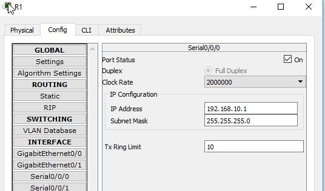
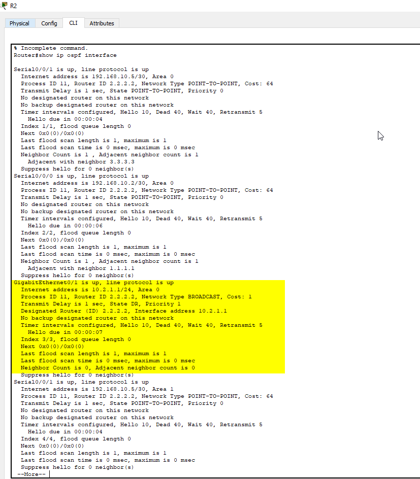

# Ejercicio 2 troubleshooting

La primera prueba que realizamos es hacer ping desde el PC2 al PC1. La realiza bien.
Pero vemos que no la gateway IP es 10.1.2.10. Esta mal, tiene que ser 10.1.2.1.
Checkeamos los otros PC, y tienen las ips y gateways correctas.

Vamos a intentar hacer ping del PC2 R2 (192.168.10.2).
No podemos, sin embargo, si que podemos acceder al 192.168.10.1, que es la salida de R1, por lo que hay algo mal ahi.

Vamos a ver la configuracion del OSPF de los routers

El R1 no tiene neighbor:

El R2 si que lo tiene:

Por lo que hay que arreglar la configuracion OSPF.
Pero antes vemos que R1 tiene diferente mascara de subred que R2:

Como la red es de CIDR 30 la subnet mask tiene que ser 255.255.255.252

Y ya se configuro:
router ospf 10
network 192.168.10.1 0.0.0.3 area 0

Ahora vamos a probar si podemos hacer ping desde el PC1:

Efectivamente podemos :)

Pero sin embargo no podemos acceder desde el PC2:

Mientras tanto, vamos a ver si ocurre lo mismo en el area 2:

Pasa exactamente igual, el PC3 puede acceder, y el PC4 no.
Por lo tanto cuando solucionemos el problema, lo solucionaremos en las dos areas.

Vamos a añadir ospf a la red 10.1.2.0 al R1

router ospf 10
network 10.1.2.1 0.0.0.255 area 1

Despues ejecutamos el comando show ip ospf interface para ver si se ha guardado la ruta y vemos que es asi:

Ya podemos acceder desde el PC2:

Ahora vamos al R3 y vemos si es similar el problema, viendo las interfaces del OSPF:

Efectivamente, tenemos que configurarlo para que el PC4 pueda acceder:

router ospf 10
network 192.168.2.1 0.0.0.255 area 2

Y ya podemos acceder al PC4:

Ahora nos falta el PC0, desde el cual no podemos acceder a ningun PC:

Vamos a ver la informacion del ospf en R2 y vemos que no tenemos la interface gig0/1 en el ospf

Y ademas nos encontramos con que la configuracion esta realizada en gig0/0 en vez de gig0/1
Asignamos la ip 10.2.1.1 con la submascara al gig0/1

int g0/1
ip address 10.2.1.1 255.255.255.0

Vemos otra vez la informacion del OSPF y aparece gig0/1

Efectivamente, vamos a ver si podemos acceder desde el PC0 al PC1, 

Efectivamente, ya podemos, hemos solucionado los problemas de red que teniamos :)

## Recursos
https://static-course-assets.s3.amazonaws.com/ScaN6/es/index.html#10.2.1.4

## Comandos para OSPF
show ip ospf neighbor
show ip interface brief
show ip ospf **interface**